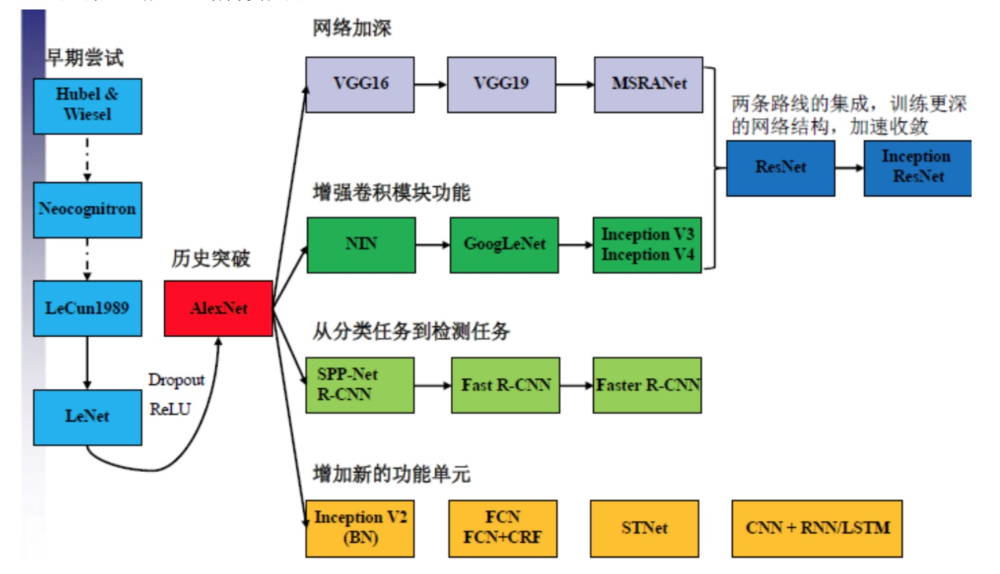

# 深度学习

深度学习（Deep Learning）是机器学习的分支，是一种试图使用包含复杂结构或由多重非线性变换构成的多个处理层对数据进行高层抽象的算法。 深度学习是机器学习中一种基于对数据进行表征学习的算法，至今已有数种深度学习框架，如卷积神经网络、深度置信网络、递归神经网络等已被应用在计算机视觉、语音识别、自然语言处理、音频识别与生物信息学等领域并获取了极好的效果。 

区别于传统的浅层学习，深度学习的不同在于： 
* 强调了模型结构的深度，通常有5层、6层，甚至10多层的隐层节点； 
* 明确了特征学习的重要性。也就是说，通过逐层特征变换，将样本在原空间的特征表示变换到一个新特征空间，从而使分类或预测更容易。与人工规则构造特征的方法相比，利用大数据来学习特征，更能够刻画数据丰富的内在信息。

通过设计建立适量的神经元计算节点和多层运算层次结构，选择合适的输人层和输出层，通过网络的学习和调优，建立起从输入到输出的函数关系，虽然不能100%找到输入与输出的函数关系，但是可以尽可能的逼近现实的关联关系。使用训练成功的网络模型，就可以实现我们对复杂事务处理的自动化要求。 

典型的深度学习模型有[卷积神经网络(convolutional neural network)](1_CNN)、深度置信网络(Deep Belief Network, DBN)、堆栈自编码网络(stacked auto-encoder network)、[循环神经网络（Recurrent Neural Network）](2_RNN)、[对抗生成网络（Generative Adversarial Networks，GAN)](3_GAN)等。

## 深度学习的发展历程

下图展示了深度学习常见网络的发展历程

## 内容

   - CNN
      - [CNN Introduction](1_CNN/CNN_Introduction.pptx)
      - [CNN simple demo](../demo_code/3_CNN_MNIST.py)
      - [Basic of Conv](1_CNN/01-basic_conv.ipynb)
      - [LeNet5](1_CNN/02-LeNet5.ipynb)
      - [AlexNet](1_CNN/03-AlexNet.ipynb)
      - [VGG Network](1_CNN/04-vgg.ipynb)
      - [GoogleNet](1_CNN/05-googlenet.ipynb)
      - [ResNet](1_CNN/06-resnet.ipynb)
      - [DenseNet](1_CNN/07-densenet.ipynb)
      - [Batch Normalization](1_CNN/08-batch-normalization.ipynb)
      - [Learning Rate Decay](1_CNN/09-lr-decay.ipynb)
      - [Regularization](1_CNN/10-regularization.ipynb)
      - [Data Augumentation](1_CNN/11-data-augumentation.ipynb)
   - RNN
      - [rnn/pytorch-rnn](2_RNN/pytorch-rnn.ipynb)
      - [rnn/rnn-for-image](2_RNN/rnn-for-image.ipynb)
      - [rnn/lstm-time-series](2_RNN/time-series/lstm-time-series.ipynb)
   - GAN
      - [gan/autoencoder](3_GAN/autoencoder.ipynb)
      - [gan/vae](3_GAN/vae.ipynb)
      - [gan/gan](3_GAN/gan.ipynb)

## 参考资料

* [深度学习 – Deep learning](https://easyai.tech/ai-definition/deep-learning/)
* [深度学习](https://www.jiqizhixin.com/graph/technologies/01946acc-d031-4c0e-909c-f062643b7273)

